# 황영주[202030336]

## [05월 04일]
>1.기본 자료형과 객체 자료형의 차이 
let number = 273; 
let string = '안녕하세요'; 
let boolean = true; 
 
console.log(typeof number); 
console.log(typeof string); 
console.log(typeof boolean); 
 
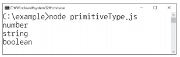 

  

>2-1 메소드 
예제 7-1 
let number = 273.5210332; 
 
console.log(number.toFixed(1)); 
console.log(number.toFixed(4)); 

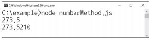 

>2-2 생성자 함수의 속성 
예제 7-2 
let numberA = Number.MAX_VALUE; 
let numberB = Number.MAX_VALUE + 1; 
 
console.log(numberA); 
console.log(numberB); 
 
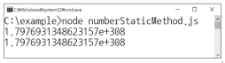 

>3 String 객체 
3-2메소드 활용  
예제 7-3 
let string = '안녕하세요. 좋은 아침입니다.'; 
if(string.index0f('아침') >= 0){ 
    console.log('좋은 아침이에요...!'); 
} 
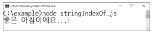 

## [04월 27일]
>객체 기본
:객체는 여러개의 자료형을 한 번에 저장하는 자료형입니다. 
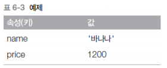 
6-1예제 
let object = { 
    name:'바나나', 
    price: 1200 
}; 
console.log(object.name); 
console.log(object.price); 

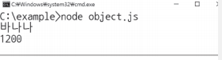 
 
 
>객체와 반복문
:생성한 객체에 for in 반복문으로 반복을 적용할 수 있습니다. 
배열에 for in 반복문을 적용할 때 앞에 선언한 변수에 인덱스가 들어갔떤 것처럼, 객체에 for in 반복문을 적용하면 키가 들어갑니다. 
예제6-2 
let object = { 
    name:'바나나', 
    price: 1200 
}; 
for(let key in object){ 
    console.log(`${key}: ${object[key]}`); 
} 

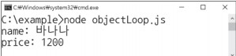 

## [04월13일]
>1 함수 생성
:이름을 붙이지 않고 생성하면 익명함수라고 하며, 이름을 붙여 생성하면 선언적 함수라고 한다. 
1.1 익명함수 
let 함수 = function (){ 
    console.log("함수의 첫번째 줄"); 
    console.log("함수의 첫번째 줄"); 
} 
함수(a); 
console.log(함수); 
 

1.2 선언적 함수 
function 함수이름() { } 
 

1.3 화살표 함수 
() => { } 
 

2 함수의 형태
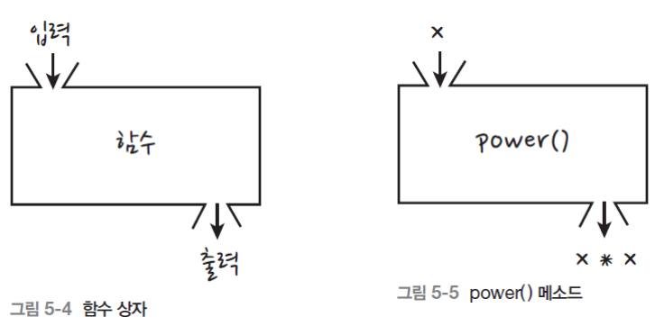

3.함수의 기본 활용 
5-2예제 
function sum(min,max) { 
    let output = 0; 
    for(let i = min; i <= max; i++){ 
        output += i; 
    } 
    return output; 
} 
 
console.log(sum(1,100)); 

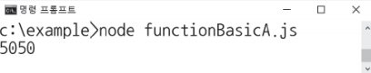

4.함수 매개 변수 초기화 
function print(name, count) { 
    if(!count) { 
        count = 1; 
    } 
 
    console.log(`${name}이/가 ${count}개 있습니다.`) 
} 
print("사과");  

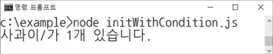 

5.콜백 함수 
function callTenTimes(callback) { 
    for(let i = 0; i < 10; i++>){ 
        callback(); 
    } 
} 
callTenTimes(function(){ 
    console.log('함수 호출'); 
});  

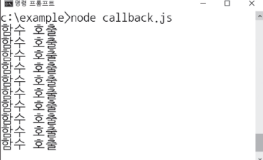 

## [04월06일]
>중첩 반복문
:반복문을 여러번 중첩해서 사용하면 중첩 반복문이라고 합니다. 
별피라미드 예제 
let output = ""; 
for (let i = 0; i < 8; i++) { 
    for (let u = 0; u < 8 - i; u++) { 
        output += " "; 
    } 
    for (let u = 0; u <= i*2; u++) { 
        output += "*"; 
    } 
    output += "\n"; 
} 
console.log(output); 
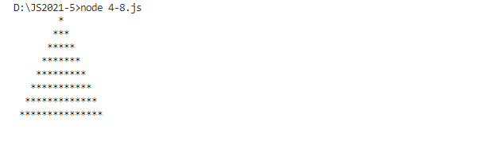 

>break키워드
:switch 조건문이나 반복문을 벗어날 때 사용 
let i =0; 
let foo = [1,3,5,7,9,2]; 
while (true){ 
    if(foo[i] % 2 == 0){ 
        output = foo[i]; 
        break; 
    } 
    i= i+1; 
} 
 
console.log(`처음 발견한 짝수는 ${output}입니다`) 
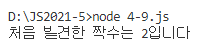 

## [03월30일]
>중첩 조건문
:조건문 안에 조건문을 중첩해 사용하는것 
if(불 표현식){ 
    if(불 표현식){ 
        문장; 
    } else{ 
        문장 
    } 
} else{ 
    if(불 표현식){ 
        문장; 
    } else{ 
        문장; 
    } 
} 

>switch 조건문
switch(비교할 값) { 
    case 값: 
        문장 
        break; 
    case 값: 
        문장 
        break; 
    default: 
        문장 
        break; 
} 
break는 switch 조건문이나 반복문을 빠져나갈 때 사용 
>삼향 연산자 
연산자이지만 프로그램의 진행을 조건에 따라 변화시킬수 있다 
<불 표현식> ? 참:거짓 
console.log(number %2 == 0? true:false); 

>|| 연산자 
let test; 

test = test || "초기화합니다_1" 
console.log(test); 
 
test = test || "초기화합니다_2" 
console.log(test); 
 
>배열 
:여러 개의 자료를 한꺼번에 다룰 수 있는 자료형입니다 
let array = [52, 273,'아침','점심',true,false] 

## [03월23일]

>문자열
    기본 문자열: 자바스크립트는 기본적인 문자열을 생성할 때 큰따옴표나 작은따옴표를 사용합니다.
    이스케이프 문자
## [03월16일]

>자바스크립트로 할 수 있는 일
2010년까지만 해도 웹 클라이언트 개발 이외의 용도로는 사용할 수 없었다 
그 이후부터 서버, 게임, 스마트폰 애플리케이션, 데스크톱 애플리케이션 개발 등에 사용하면서 굉장히 다양한 일을 할 수 있게 되었습니다. 
자바스크립트로 만든 데스크톱 애플리케이션 아톰 VSCode GitKraken 
유니티는 모노 플랫폼을 사용해 자바스크립트를 기반으로 만든 유니티 스크립트를 통해 다양한 플랫폼을 만들어냈다 

>자바스크립트 실행 방법 명령프롬프트와 node를 이용하여 실행을 직접해봤다
hello.html을 연습실행해보았습니다

>값을 만들어 내는 간단한 코드를 표현식이라고 하고 표현식이 하나 이상 모이면 문장이라 한다. 문장 끝에는 ;을 찍어준다. 그리고 문장이 모이면 프로그래이 된다. 

>키워드 
break else instanceof true case false new try catch finally null typeof continue for return var default function switch void delete if this while do in throw with let const 등이 있다. 다음에 공부할때 다 배우니 키워드가 있다고만 알고 있자.

>식별자는 이름을 붙일 때 사용하는 단어, 변수와 함수의 이름으로 사용
    키워드를 사용하면 안됩니다.
    특수문자는 _와 $만 허용합니다.
    숫자로 시작하면 안 됩니다.
    공백은 입력하면 안 됩니다.

>주석을 사용하는 방법을 알았습니다.
// 한 줄 주석처리
/* 여러 줄 주석처리 */